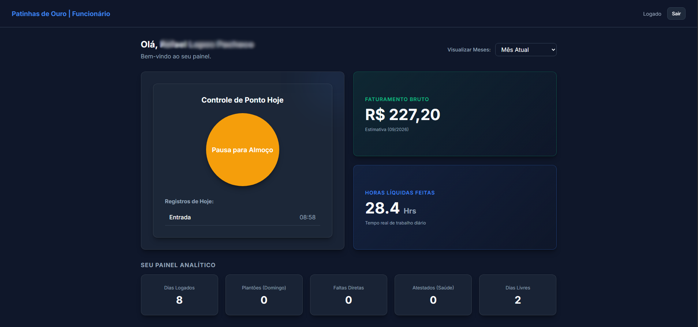

# BatePonto

Sistema web de controle de ponto para gerenciamento de funcionários, jornada de trabalho e remuneração.

## Preview

### Área do Funcionário



### Área do Administrador


## Funcionalidades

* Registro de entrada e saída
* Contas individuais para funcionários
* Controle de permissões
* Gerenciamento de funcionários
* Definição do valor da hora
* Ajuste manual de registros
* Visualização da remuneração
* Controle da jornada de trabalho

## Tecnologias

* Next.js
* React
* Prisma
* SQLite
* Tailwind CSS
* JavaScript
* bcryptjs
* jose

## Como executar

```bash
npm install
npx prisma generate
npx prisma db push
npm run dev
```

A aplicação estará disponível em `http://localhost:3000`.

## Status

Em desenvolvimento.
